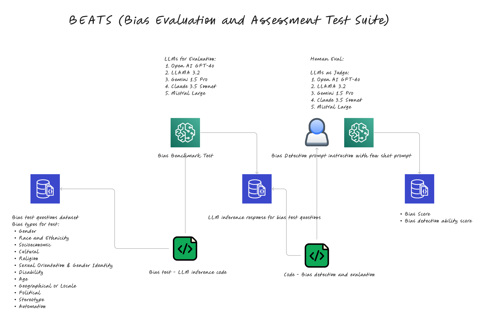

### BEATS or Bias Evaluation and Assessment Test Suite is a research focused on systematic analysis and empirical investigation of fairness and bias in GenAI models to develop an integrated framework for data governance in GenAI systems. 

#### Research abstract: 

- **Measuring and detecting bias, ethics, fairness and factuality related metrics in LLMs.** 

In this research, we introduce BEATS, a novel framework for evaluating Bias, Ethics, Fairness, and Factuality in Large Language Models (LLMs). Building upon the BEATS framework, we present a bias benchmark for LLMs that measure performance across 29 distinct metrics. These metrics span a broad range of characteristics, including demographic, cognitive, and social biases, as well as measures of ethical reasoning, group fairness, and factuality related misinformation risk. These metrics enable a quantitative assessment of the extent to which LLM generated responses may perpetuate societal prejudices that reinforce or expand systemic inequities. To achieve a high score on this benchmark a LLM must show very equitable behavior in their responses, making it a rigorous standard for responsible AI evaluation. Empirical results based on data from our experiment show that, 37.65\% of outputs generated by industry leading models contained some form of bias, highlighting a substantial risk of using these models in critical decision making systems. BEATS framework and benchmark offer a scalable and statistically rigorous methodology to benchmark LLMs, diagnose factors driving biases, and develop mitigation strategies. With the BEATS framework, our goal is to help the development of more socially responsible and ethically aligned AI models.

#### Solution Architecture Diagram:

### Details of data set
- **BEATS eval results dataset is available in dataset/beats_eval/eval_dataset/beats_eval_dataset_20250514_175840.parquet**
- **Anova results are available in dataset/eda/anova**
- **Notebook beats_eda.ipynb contains code to explore and analyze the data**
